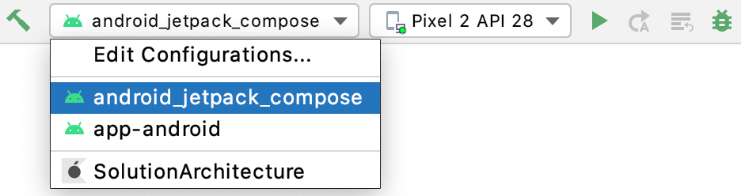

# Solutions architecture sample

Вам понадобится Android Studio 4.1 RC или старше

## 1. Repo update
```bash
ssh-add
./repo.sh update
```

## 2. Run android
Для запуска Android выбираем run конфигурацию android_jetpack_compose  

  
Но также можно просто собирать из консоли ./android_install.sh
А потом установить app-android/build/outputs/apk/debug/app-android-debug.apk  

## 3. Build iOS App

#First time install
```bash
sudo gem install cocoapods
sudo gem install cocoapods-generate
```

## Repeat on code update
```bash
./gradlew podImport
pod install
pod update
#open [./ios/App/SolutionArchitecture.xcworkspace] in XCode or AppCode and run project on iOS Emulator
#or use KMM Android Studio plugin
```


